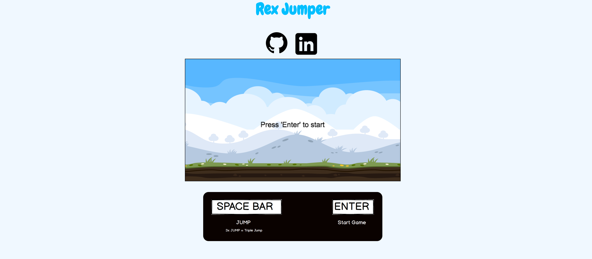
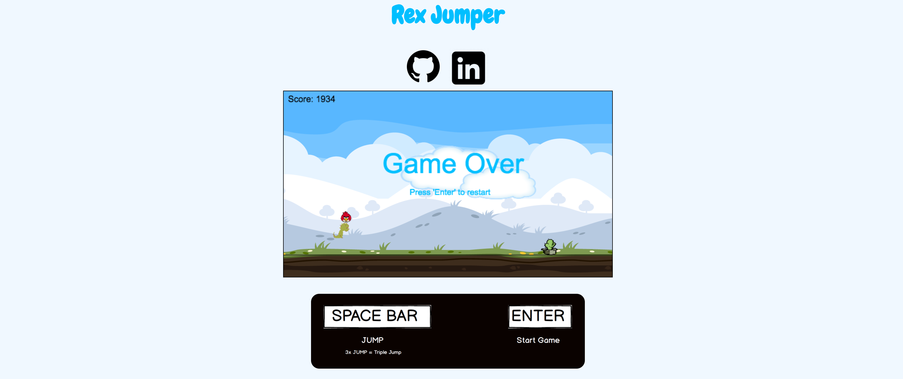

# Rex Jumper

[Rexjumper] is a JavaScript game inspired by T-Rex Runner built using vanilla JavaScript and Canvas





[Rexjumper]: https://dankim93.github.io/rex-jumper/

## Features
- Ability to Jump over objects
- Start and Restart the game
- Triple jump available once player leaves the ground

##### Collision Detection
```JavaScript
collision(rect1, rect2, rect3) {
  if (rect1.DIM_X < rect2.DIM_X + 30 &&
      rect1.DIM_X + 30 > rect2.DIM_X &&
      rect1.DIM_Y < rect2.DIM_Y + 30 &&
      30 + rect1.DIM_Y > rect2.DIM_Y) {
        clearInterval(this.init);
        this.collided = true;
        this.drawGameover();

  } else if (rect1.DIM_X < rect3.DIM_X + 20 &&
      rect1.DIM_X + 30 > rect3.DIM_X &&
      rect1.DIM_Y < rect3.DIM_Y + 20 &&
      30 + rect1.DIM_Y > rect3.DIM_Y) {
        clearInterval(this.init);
        this.collided = true;
          this.drawGameover();
  }
}
```
- Every frame, collision function is used to detect if any of `bird` or `cactus` is touching the `player`

## Project Design

Rex Jumper was designed and built in 5 days.

  - Started with [proposal] [proposal] to plan out and make the skeleton of this project.

  [proposal]: ./docs/README.md

## Technology

  - Vanilla JavaScript
    + object-oriented design to manipulate pieces easier
    + pure JavaScript without using any other libraries
  - HTML5 canvas
    + DOM manipulation and rendering
  - CSS3
    + Style and Reposition boxes in HTML
