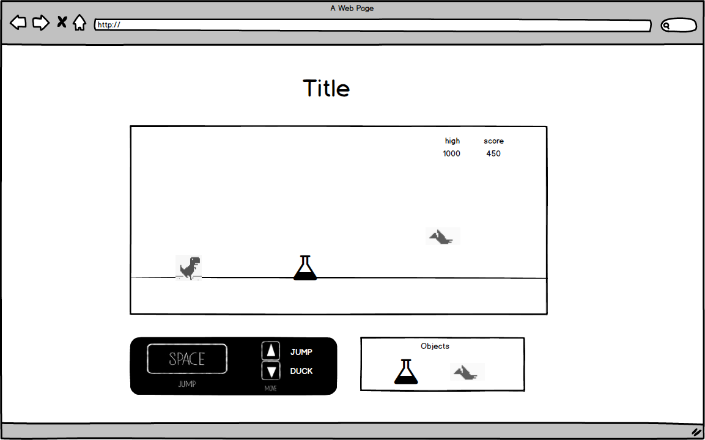

## Rex Jumper

### Background

Rex Jumper is a game inspired by T-Rex Runner, where the player runs without stopping and tries to dodge the objects by jumping over them or ducking to avoid them. The player loses once the object hits the player.

### Functionality & MVP

Game Functionalities:

- [ ] Constantly moving player
- [ ] Objects in the way of moving player
- [ ] Ability to Jump to avoid objects

In addition, this project will include:

- [ ] An About modal describing the background and rules of the game
- [ ] A production Readme

### Wireframes

This app will consist of a single screen with a start button and nav bar with links to my Github and LinkedIn. When the game starts, T-rex or the user starts to run in one direction, which speed accelerates as time goes by.

### Architecture and Technologies

In addition to the webpack entry file, there will be three scripts involved in this project:

- Vanilla JavaScript and `jquery` for overall structure and game logic,
- `Easel.js` with `HTML5 Canvas` for DOM manipulation and rendering,
- Webpack to bundle and serve up the various scripts.

In addition to the webpack entry file, there will be three scripts involved in this project:

`view.js`: this script will handle the logic for creating and updating the necessary `Easel.js` elements and rendering them to the DOM.

`game.js`: this script will handle the logic behind the scenes. this will also detect `object` colliding with `player` object. Change the speed depending on their current score.

`object.js`: this script will be the objects. Each object is different with different movement.

### Implementation Timeline

**Day 1**: Setup all necessary Node modules, including getting webpack up and running and `Easel.js` installed.  Create `webpack.config.js` as well as `package.json`.  Write a basic entry file and the bare bones of all 3 scripts outlined above.  Learn the basics of `Easel.js`.  Goals for the day:

- Get a green bundle with `webpack`
- Learn enough `Easel.js` to render an object to the `Canvas` element

**Day 2**: Dedicate this day to learning the `Easel.js` API.  First, build out the `player` object to connect to the `view` object.  Then, use `view.js` to create and render at `player` and `object`.  Build in the ability to make player automatically run towards the `object`.  Goals for the day:

- Complete the `object.js` module (constructor, update functions)
- Render a `player` and `object` to the `Canvas` using `Easel.js`
- Make `player` to run looking like objects are getting closer to the player

**Day 3**: Create the logic backend. Keep track of scores and detect the collision between `object` and the `player`. Goals for the day:

- Let the player jump or duck
- Game ends with replay button when the `player` collides with an `object`

**Day 4**: Install the controls for the user to interact with the game.  Style the frontend, making it polished and professional.  Goals for the day:

- Create controls for game to stop, start, and reset
- Have a styled `Canvas`, nice looking controls and title

### Bonus features
- [ ] Allow t-rex to duck
- [ ] Allow t-rex to shoot fireballs to kill flying objects.
- [ ] Add colors
